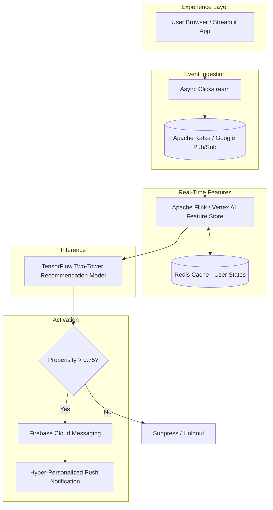
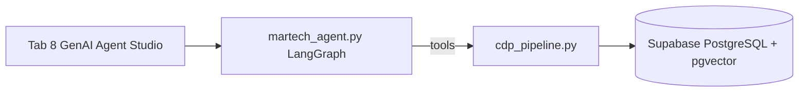

# Personalization & Marketing Tech Simulator

🔗 **[Live demo →](https://blank-app-zwp52hqbzm2sxhgqckmv6w.streamlit.app/)** · No setup required · Start at the **Product Guide** tab

---

## Why This Was Built

**Situation:** Retention was declining and average order value was slipping on a digital marketplace. Shoppers weren't finding their next purchase, and marketing was burning spend on untargeted outreach with no guardrails on frequency or relevance.

**Task:** Design and build a real-time personalization and marketing orchestration system that predicts next-purchase intent, gates outreach on propensity, and explains every decision — without requiring a data warehouse or production infrastructure.

**Actions:** Built a full demo stack: agentic RAG over a Supabase CDP, pgvector semantic retrieval, a hybrid A/B ranking engine, and propensity-gated push notifications — orchestrated with LangGraph and cost-efficient GenAI models across a Streamlit UI.

**Result:** A working interactive prototype demonstrating the full decision loop — profile → rank → guardrail → notify → measure — with explainability surfaced at every step. Based on comparable e-commerce deployments, personalization architectures of this type typically drive 15–25% lift in CTR and 8–12% improvement in average order value. This simulator is built to demonstrate the decision logic behind those outcomes.

---

## Stack

**Streamlit** · **Supabase** (PostgreSQL + pgvector + Realtime + Auth + RLS) · **LangGraph** (ReAct agent) · **sentence-transformers** (MiniLM, 384-d HNSW) · **LangChain + OpenAI tool-calling** · **Next.js 14** · **Fastify** · **Upstash Redis / BullMQ** · **Recharts** · **Tailwind CSS + shadcn/ui**

---

## Key Decisions & Trade-offs

These are the deliberate architectural choices made during the build — and what each one costs.

| Decision | Why | Trade-off accepted |
|---|---|---|
| **Supabase + pgvector** over a dedicated vector DB | Speed of iteration; HNSW (Hierarchical Navigable Small Search) at demo scale is sufficient and removes infra overhead | Would migrate to Vertex Matching Engine or Pinecone |
| **LangGraph ReAct agent** over a single-shot prompt chain | Tool-calling transparency produces observable telemetry traces; Dan inspect reasoning step by step | More moving parts than a direct chain; justified for agentic RAG storytelling |
| **Propensity threshold hardcoded at 0.75** | Keeps suppression logic explicit and auditable in the demo | In production, this becomes a calibrated ML output, not a fixed constant |
| **Two ranking variants (A/B) exposed in the UI** | Stakeholders can *see* the experiment design in action, not just hear about it | Adds UI complexity; acceptable trade-off for portfolio clarity |
| **Streamlit UI** over a full Next.js frontend | Rapid iteration on ML and data logic; keeps the demo stack focused on personalization, not CSS | Not a production UI pattern; a real deployment would use the Next.js app |
| **Medallion architecture (Bronze → Silver → Gold)** as in-memory simulation | Demonstrates production data pipeline thinking without requiring Flink or Dataflow | Actual stream processing is mocked; production mapping is documented explicitly |
| **Shoe suppression as a hard guardrail** | Demonstrates that business rules gate ML output — ML doesn't operate without constraints | A more sophisticated system would use probabilistic suppression with decay curves |

---

## Choose Your View

| Persona | Best for | Jump to |
|---------|----------|---------|
| **Business Impact Walkthrough** | Business stakeholders, product managers, interview storytelling, first-time viewers | [Business Impact Walkthrough →](#business-impact-walkthrough) |
| **Architecture & Implementation** | Engineers, architects, demo operators, Supabase/CDP setup | [Architecture & Implementation →](#architecture--implementation) |

---

## Business Impact Walkthrough

> Think of this as a **practice store** running on a laptop. It is not a real shop with real customers — it is a demonstration of how a large digital marketplace could show the right product to the right person at the right time, without over-messaging them or ignoring their privacy.

### The business problem it simulates

Imagine a **sports retail website** with **500 products** and **100 sample members** — new customers, loyal runners, lapsed buyers, and more. The same scale pattern used when the retention and AOV crisis was originally analyzed.

The simulator shows how a company would:

- Personalize what each person sees in real time
- Predict and promote the **next likely purchase**
- Run **push notifications** only for high-intent items — not blanket campaigns
- Test two ranking strategies before a full rollout
- Use **agentic RAG** so marketing and sales can execute plays in plain English

### What the solution demonstrates

| Capability | What it does for the business |
|------------|-------------------------------|
| **Hyper-personalized recommendations** | Ranks products in real time from profile + session behavior (Variant A/B) |
| **Next-purchase prediction** | Blends declared interests, browse intent, clicks, and history to surface what a member may buy next |
| **Vector database (semantic search)** | Finds products by *meaning* — "hydration for marathon training" — not just keywords |
| **Agentic RAG (Tab 8)** | Marketing asks in natural language; AI pulls the profile, checks rules, searches the catalog, and queues outreach |
| **GenAI orchestration** | Cost-efficient model tier for agent reasoning (optional full LLM toggle) |
| **Propensity-gated push** | Sends mobile push only when score **> 0.75** and all suppression rules pass |

### The workflow — step by step

```
Pick a customer → See personalized products → Decide on marketing → Measure results
```

#### Step 1 — Choose your customer (Tab 1: Member & Strategy)

Pick a type of shopper: a "High-Value Runner," a new customer, someone with full data consent vs. limited. Every customer has a profile — declared interests, purchase history, email opt-in status. You can't personalize for "everyone." You start with one person's situation.

#### Step 2 — Show personalized products (Tab 2: Recommendations)

Browse a product grid. Click **View** or **Click** on items. The list reorders as you interact — the same way Netflix adjusts what it shows based on what you just watched.

**Two ranking strategies are available:**

| | **Variant A** | **Variant B** (default) |
|---|---|---|
| **Simple idea** | "What are you doing *right now*?" | "Who are you *plus* what are you doing now?" |
| **Example** | You clicked 3 hydration vests → show more hydration gear | You're a marathon runner *and* you clicked vests → show a running + hydration mix |

Each product card shows **"Why am I seeing this?"** so the system is never a black box.

#### Step 3 — Marketing decisions (Tab 3: Marketing & Ads)

See whether this customer should receive an email, a push notification, or nothing at all. Real companies don't blast everyone. The simulator enforces rules like:

- "They bought shoes 2 weeks ago → suppress shoe ads"
- "They've received 3 emails this week → frequency cap reached"
- "They haven't consented to marketing → don't contact them"

**Propensity score (0 to 1):** A readiness-to-message score. Only when it exceeds **0.75** does the system queue a push notification. Otherwise it suppresses — on purpose.

#### Step 4 — Measure and experiment (Tabs 4 & 5)

- **Portfolio Metrics** — executive view: clicks, conversions, return on ad spend
- **A/B Testing Lab** — compare Variant A vs. Variant B before rolling out to millions of users

#### Step 5 — Trust & architecture (Tabs 6 & 7)

Privacy principles and end-to-end data flow: website → decision engine → marketing message. Built for roadmap and stakeholder conversations.

#### Step 6 — AI marketing assistant (Tab 8: GenAI Agent Studio)

Type in plain English:

```
This customer looked at shoes 3 times but bought shoes 2 weeks ago.
Suggest hydration gear — not shoes.
```

The agent then: (1) looks up the customer profile, (2) checks the suppression rules, (3) searches the product catalog for good matches, and (4) decides whether to queue a notification.

**Built-in demo persona:** `USER_7721` — a serious runner who bought shoes 14 days ago. The system should not push more shoes. It surfaces a hydration vest instead.

### What this demonstrates — and what it intentionally omits

| What this demonstrates | What it intentionally omits |
|---|---|
| System design thinking across ingestion, ranking, guardrails, and activation | Production infra (Kafka, Flink, Vertex) — see [Production Architecture Blueprint](#production-architecture-blueprint) |
| Agentic RAG with observable, step-by-step tool-calling traces | Real customer PII — replaced with 100 generated personas |
| A/B experiment design with hypothesis, guardrails, and readout | Statistical significance at scale — simulated for demo purposes |
| Explainability on every recommendation | Real-time model retraining |
| Consent-aware suppression and frequency capping | Multi-channel orchestration (SMS, in-app, email in one pipeline) |

### One-sentence summary

**This simulator was built in response to a retention and average-ticket crisis — demonstrating how agentic RAG, vector search, real-time next-purchase recommendations, and propensity-gated push can win back shoppers while respecting privacy and business rules.**

### 5-minute demo path

**Product Guide tab** → Tab 1 (Run Simulation) → Tab 2 (click a few products) → Tab 3 (check push/email rules) → Tab 8 (run the sample prompt for `USER_7721`)

[↑ Back to top](#personalization--marketing-tech-simulator)

---

## Architecture & Implementation

Technical reference for engineers, architects, and demo operators. Covers architecture decisions, module layout, Supabase CDP setup, variant scoring, and runbooks.

**Quick navigation:**

| Topic | Section |
|-------|---------|
| Demo data scope | [Demo scope](#demo-scope) |
| Code layout | [Project structure](#project-structure) |
| Production target architecture | [Production architecture blueprint](#production-architecture-blueprint) |
| App tabs & sidebar | [App tabs](#app-tabs) · [Sidebar controls](#sidebar-controls) |
| Variant A vs B scoring | [Recommendation Variants — STAR Guide](#recommendation-variants--star-guide) |
| CDP + agentic RAG | [Agentic RAG, CDP, and autonomous agent](#agentic-rag-cdp-and-autonomous-agent) |
| Supabase setup | [Before demo — complete checklist](#before-demo--complete-checklist) |
| Run locally | [How to run locally](#how-to-run-locally) |
| Model evaluation | [Model evaluation](#model-evaluation) |
| Live demo script | [Demo script](#demo-script-57-minutes) |
| Scoring formulas | [Scoring logic](#scoring-logic) |
| Troubleshooting | [Troubleshooting](#troubleshooting) |

Core UI logic: `streamlit_app.py`. MarTech signal processing, hybrid ranking, and propensity-gated notifications: `martech_engine.py`. Production-style CDP on Supabase + pgvector: `cdp_pipeline.py`. Autonomous campaign agent: `martech_agent.py`. Chat UI and telemetry: `genai_agent_studio.py`.

---

## Demo scope

- 500 generated products across sport categories, audiences, and product types
- 100 generated members split across repeat and new customers, men and women, demographics, browser signals, and app usage
- Explore-vs-exploit ranking for repeat and new customers
- Lifecycle orchestration for new visitors, first-purchase prospects, repeat runners, lapsed runners, active members, and high-value members
- Privacy modes: full consent, limited consent, and no app usage data
- Explainable recommendation labels for storytelling
- Sale and trending product ribbons
- Dropdown filtering: men, women, kids, footwear, apparel, accessories
- Shoe email suppression when a member recently purchased footwear
- Running shoe email reactivation after the 5.5-month replenishment window
- App usage signals, frequency caps, channel preferences, and consent-aware MarTech email decisions
- Simulated A/B experiment metrics and executive business impact estimates
- Dedicated A/B Testing Lab with hypothesis, population, randomization unit, traffic allocation, sample assumptions, primary metric, guardrails, variants, result readout, and launch checklist
- Sponsored product auction and portfolio metrics
- Trust & Safety, privacy guardrails, reference architecture, and product pain points for roadmap conversations
- Architecture Diagram tab visualizing end-to-end product workflow
- **MarTech engine** (`martech_engine.py`): mock Bronze → Silver → Gold medallion layers for 0-party and session behavioral signals
- **Hybrid recommendations**: sidebar A/B variant (behavioral-only vs. 0-party + behavioral blend) with instant re-ranking on View/Click
- **Live product grid** with per-card "Why am I seeing this?" captions driven by current member state
- **Propensity-scored push notifications**: queue only when score > 0.75; inspect decisions in **MarTech Backend: Propensity Logs** (sidebar)
- **Supabase CDP**: stitched schema (`consumers`, `products`, `behavioral_logs`) with HNSW vector index and `match_products` RPC
- **CDP pipeline** (`cdp_pipeline.py`): golden-record stitch, semantic search, agent context compilation
- **Autonomous MarTech agent** (`martech_agent.py`): LangGraph ReAct + OpenAI tool-calling over CDP tools
- **GenAI Agent Studio (Tab 8)**: chat UI, reasoning telemetry trace, simulated push notification card

---

## Project structure

| File / path | Purpose |
|-------------|---------|
| `streamlit_app.py` | Main UI — 9 tabs, session state, command-bar variant controls |
| `product_guide.py` | Tab 0 — Business Impact Walkthrough (in-app onboarding) |
| `personascale_ui.py` | Enterprise CSS, KPI shelf, product cards, engine telemetry |
| `martech_engine.py` | Medallion layers, hybrid ranking, interaction tracking, propensity scoring |
| `genai_agent_studio.py` | Tab 8 — chat, telemetry trace, CDP/simulator orchestration UI |
| `cdp_pipeline.py` | Supabase CDP: stitch golden record, embed + `match_products`, agent context |
| `martech_agent.py` | LangGraph agent: profile, guardrails, inventory search, queue notification |
| `seed_data.py` | In-memory product registry and simulated 1st-party event logs |
| `ranking.py` | Base 0-party ranking, lifecycle email rules, A/B simulation helpers |
| `data_generator.py` | Marketplace bootstrap via `initialize_marketplace()` |
| `auction.py` | Sponsored product auction scoring |
| `metrics.py` | CTR, conversion, ROAS, and diversity metrics |
| `supabase/migrations/...sql` | CDP DDL: pgvector, tables, HNSW index, `match_products` RPC |
| `supabase/seed_demo.sql` | Demo row: `USER_7721`, HydroStream vest, behavioral view events |
| `scripts/pre-demo.ps1` | Pre-demo health checks + checklist |
| `scripts/setup-cdp-venv.ps1` | Creates `.venv-cdp` (Python 3.12) for CDP/agent deps |
| `scripts/backfill_product_embeddings.py` | Writes 384-d embeddings to Supabase `products` |
| `scripts/run-model-eval.ps1` | Phase-1 eval wrapper (retrieval + guardrails) |
| `eval/` | Model eval: golden dataset, classification factors, phase 1 & 2 runners |
| `eval/golden/cases.jsonl` | Phase-1 golden cases (guardrails + retrieval) |
| `eval/golden/agent_cases.jsonl` | Phase-2 golden cases (LLM agent) |
| `eval/classification_factors.py` | `top_k`, `temperature`, `top_p` factor schema and sweeps |
| `requirements.txt` | Streamlit app only (Python 3.10–3.14) |
| `requirements-cdp.txt` | Supabase + sentence-transformers |
| `requirements-agent.txt` | LangChain + LangGraph + OpenAI |
| `.env` | `SUPABASE_URL`, `SUPABASE_KEY`, optional `OPENAI_API_KEY` (gitignored) |

---

## Production architecture blueprint

This prototype simulates the product surface in Streamlit. The blueprint below is the **target production architecture** for scaling real-time personalization, feature serving, and propensity-gated push orchestration.

### End-to-end flow

```
[User Browser / App]
       │
       ▼ (Async Clickstream)
[Apache Kafka / Google Pub/Sub]
       │
       ▼ (Stream Processing)
[Apache Flink / Vertex AI Feature Store] <───> [Redis Cache (User States)]
       │
       ▼ (Inference)
[TensorFlow Two-Tower Recommendation Model]
       │
       ▼ (If Propensity > 0.75)
[Firebase Cloud Messaging] ───> (Hyper-Personalized Real-Time Push Notification)
```



### Layer responsibilities

| Layer | Production service | Role in simulator |
|-------|-------------------|-------------------|
| Experience | Web/Mobile app | Member strategy UI, recommendation shelf, telemetry (`streamlit_app.py`, `personascale_ui.py`) |
| Clickstream | Kafka / Pub/Sub | Durable async events: views, clicks, PDP dwell, cart signals |
| Stream processing | Flink / Dataflow + Feature Store | Bronze → Silver → Gold feature materialization, session aggregation |
| Online state | Redis | Sub-10ms user profile, frequency caps, last-N interactions, propensity inputs |
| Ranking | Two-tower TF model | Hybrid retrieval: 0-party tower + behavioral tower (`rank_products_variant`) |
| Propensity gate | Rules + ML calibrator | Score 0.0–1.0; activate push only above **0.75** (`martech_engine.compute_propensity_score`) |
| Activation | Firebase Cloud Messaging | Real-time push with consent, channel, and lifecycle guardrails |

### Demo → production mapping

| Prototype module | Production equivalent |
|------------------|----------------------|
| `seed_data.get_mock_1st_party_data()` | Feature Store + CRM/CDP purchase and engagement history |
| `martech_engine` medallion layers | Flink jobs writing to BigQuery / Feature Store entities |
| `st.session_state["interactions"]` | Kafka topic `clickstream.v1` consumed into Redis user state |
| `rank_products_variant` (A/B) | Two-tower serving with experiment flags (LaunchDarkly / Vertex Experiments) |
| Propensity logs expander | Observability: Datadog + BigQuery audit table for decision traces |
| Notification queue (session state) | FCM topic sends with idempotency keys and rate limiting |

### Scalability and reliability patterns

- **Ingest:** partition Kafka/Pub/Sub by `member_id`; at-least-once delivery with dedupe keys on `(member_id, event_id)`
- **Features:** Flink windowed aggregations (1m / 1h / 7d) into Vertex AI Feature Store; Redis as online serving cache with TTL aligned to session length
- **Inference:** two-tower batch embeddings offline; online ANN retrieval (Vertex Matching Engine) + lightweight rerank for business rules (margin, inventory, consent)
- **Propensity:** separate calibrator model or logistic layer on top of rank score; hard guardrails for consent, frequency cap, and channel preference before FCM
- **Push:** async worker pool reading "eligible notification" topic; FCM with collapse keys, quiet hours, and holdout buckets for incrementality measurement
- **SLOs (targets):** clickstream ingest p99 < 2s · feature freshness < 60s · rank + propensity p99 < 150ms · push dispatch < 5s from trigger event

### Security and privacy

- Consent flags gate all behavioral features before Feature Store write
- PII tokenization at ingest; Redis keys use hashed `member_id`
- FCM payloads contain no raw health or precise location data; use category-level affinity only

---

## App tabs

| Tab | Name | Primary demo value |
|-----|------|-------------------|
| 0 | **Product Guide** | Business Impact Walkthrough — what the product does, workflow, 5-minute path |
| 1 | Member & Strategy | Configure member, privacy, sliders; **Run Simulation** (required for Tab 8 fallback) |
| 2 | Recommendations | Live grid, hybrid ranking, explainability |
| 3 | Marketing & Ads | Email rules, propensity-gated push |
| 4 | Portfolio Metrics | Executive metrics |
| 5 | A/B Testing Lab | Experiment design readout |
| 6 | Trust & Safety | Privacy principles and architecture story |
| 7 | Architecture Diagram | End-to-end workflow |
| 8 | **GenAI Agent Studio** | **Agentic RAG** — natural language chat, tool telemetry, push alert |

## Sidebar controls

- **Recommendation Variant** — Variant A (behavioral-only) or Variant B (hybrid: 70% base ranker + 30% session behavioral)
- **MarTech Backend: Propensity Logs** — expandable log of push propensity evaluations (score, threshold, queued vs. suppressed)

---

## Recommendation Variants — STAR Guide

Use this guide to pick the right ranking variant for your demo, interview story, or A/B experiment. Toggle variants with the horizontal radio buttons below the KPI shelf, or confirm the active arm in the sidebar Experiment Controls.

### Situation

A marketplace member is browsing the Recommendations tab. The platform ranks ~500 products in real time using a mix of:

- **0-party signals** — declared interests, browser intent, app affinity, lifecycle stage, audience fit, margin, and explore/exploit sliders (Tab 1)
- **Behavioral signals** — in-session View/Click events, plus mock 1st-party history (dwell time, prior purchases, email engagement from `seed_data`)

### Task

Choose the variant that matches the story you want to tell:

| Your goal | Recommended variant |
|-----------|---------------------|
| Show instant session retargeting after View/Click | **Variant A** |
| Show balanced personalization (profile + session) | **Variant B** (default) |
| Demo lifecycle / merchandising rules from Tab 1 sliders | **Variant B** |
| Demo privacy-limited profiles (Limited / No app usage consent) | **Variant A** |
| Run the A/B Testing Lab "behavior-only" control arm | **Variant A** |
| Run the A/B Testing Lab "hybrid" treatment arm | **Variant B** |
| Raise propensity score quickly via clicks for Tab 3 push demo | **Variant A** |
| Present a production-like default to stakeholders | **Variant B** |

### Actions

#### Switching variants

1. Tab 1 → configure member, privacy, sliders → **Run Simulation**
2. Tab 2 → Recommendations
3. Select **Variant A: Behavioral-Only** or **Variant B: Hybrid Model** on the horizontal radios below KPI metrics
4. Click **View** or **Click** on product cards — ranking re-runs on each interaction

#### What each variant does

| | **Variant A: Behavioral-Only** | **Variant B: Hybrid Model** |
|---|---|---|
| **Primary signal** | Session + 1st-party behavioral affinity | Full 0-party ranker blended with behavioral |
| **Scoring formula** | `72% behavioral + 14% popularity + 10% trend + 4% recency` | `70% rank_products() base score + 30% behavioral` |
| **Uses Tab 1 explore/exploit slider** | No | Yes |
| **Uses lifecycle / interest / browser / app scores** | Indirectly (behavioral layer only) | Yes — full weighted 0-party model |
| **Responds to View/Click** | Strongly — grid reshuffles within 1–2 clicks | Moderately — session nudges a profile-ranked list |
| **Default** | No | **Yes** |

**Behavioral score** (used by both variants) combines:
- **Session activity (55%)** — per-product views/clicks and category-level engagement from the current session
- **Mock 1st-party history (45%)** — high-dwell categories, affinity tag overlap, prior purchases, and email clicks from `seed_data`

Implementation: `rank_products_variant()` in `martech_engine.py`.

#### Variant A — Behavioral-Only

- Ignores the full `rank_products()` composite score for ordering
- Best when current session intent should drive the shelf: "They clicked three hydration vests; surface accessories now"
- Cards show **"Why am I seeing this? [Behavioral-only ranking]"** when session or 1st-party activity is strong

#### Variant B — Hybrid Model

- Runs the complete 0-party ranker first (`interest_score`, `browser_score`, `app_score`, `lifecycle_score`, explore/exploit noise, margin boosts)
- Layers behavioral affinity on top at 30% weight so merchandising guardrails stay intact while session clicks still matter
- Cards show **"Why am I seeing this? [Hybrid ranking] … hybrid model blending 0-party + behavioral scores"**

### Results

#### Expected outcomes by variant

| Scenario | Variant A | Variant B |
|----------|-----------|-----------|
| Fresh session, no clicks | Trending / popular / recency-led shelf | Interest-, lifecycle-, and browser-aligned shelf from Tab 1 profile |
| After 2–3 Views on one category | That category climbs quickly | Top products shift modestly; profile-fit items often remain near top |
| Explore vs. Exploit slider at 80% exploit | Minimal effect | Exploit weights strongly shape base score before behavioral blend |
| Limited consent privacy mode | Still reranks from session clicks | Base ranker uses reduced signal set; hybrid still applies |
| A/B Testing Lab narrative | Control arm: "What if we only used clickstream?" | Treatment arm: "What if we blended CRM profile + clickstream?" |

#### Quick decision flow

```
Need session clicks to visibly move the grid in < 30 seconds?
  └─ Yes → Variant A

Need Tab 1 sliders to affect ranking?
  └─ Yes → Variant B

Stakeholder or full portfolio demo?
  └─ Yes → Variant B (default)

Demo real-time retargeting or propensity-from-clicks for Tab 3 push?
  └─ Yes → Variant A, then click products before opening Marketing & Ads
```

---

## Agentic RAG, CDP, and autonomous agent

### Architecture (demo stack)



| Layer | Component | Role |
|-------|-----------|------|
| Experience | `genai_agent_studio.py` | `st.chat_input`, chat history, telemetry expander, `st.success` push card |
| Agent | `martech_agent.py` | ReAct loop; tools: `get_customer_profile`, `evaluate_guardrails`, `search_inventory`, `queue_notification` |
| CDP | `cdp_pipeline.py` | Golden record stitch; MiniLM embeddings; `match_products` RPC |
| Data | Supabase | `consumers`, `products`, `behavioral_logs`; HNSW on `description_embedding` |

### Demo persona: `USER_7721`

After `seed_demo.sql`:

- **Segment:** High-Value Runner · **Interests:** Marathon Training, Trail Running
- **Guardrail:** shoe purchase **14 days ago** → `shoe_promotions_suppressed = true`
- **Behavior:** 3× views on `AeroGlow Shoes` (logged in `behavioral_logs`)
- **Catalog target:** `ACC-004` HydroStream 2L Hydration Vest

### Agent tools (what the LLM calls)

1. **`get_customer_profile(user_id)`** — Bronze/Silver/Gold stitch: profile + last 10 behavioral events
2. **`evaluate_guardrails(user_id)`** — Suppression window, frequency cap, consent, `outreach_allowed`
3. **`search_inventory(query, user_id)`** — Cosine ANN via `match_products`; auto-excludes Footwear when suppressed
4. **`queue_notification(user_id, message)`** — Inserts `push_sent` into `behavioral_logs` + local JSON queue under `artifacts/notification_queue/`

### Strict agent policy (system prompt)

- Always: profile → guardrails → search → (optional) queue
- **Must not** promote footwear when shoe suppression is active — even if the user prompt mentions shoe browsing
- Pivot to accessories/apparel/hydration via vector search
- Queue outreach only when `outreach_allowed` is true

---

## Before demo — complete checklist

### A. One-time Supabase setup

1. Open your project → **SQL Editor**
2. Run `supabase/migrations/20260518120000_cdp_stitched_schema.sql` (creates extension, tables, HNSW index, RPCs)
3. Run `supabase/seed_demo.sql` (inserts `USER_7721`, product `ACC-004`, sample behavior)
4. Backfill embeddings (required for non-empty vector search):

```powershell
.\.venv-cdp\Scripts\python.exe scripts\backfill_product_embeddings.py
```

**Expected:** console prints `Embedded: ACC-004` (and any other SKUs without vectors).

### B. Local environment

| Step | Command / action | Expected result |
|------|------------------|-----------------|
| Copy secrets | `.env.example` → `.env` | File gitignored |
| Supabase URL | `SUPABASE_URL=https://<ref>.supabase.co` | Matches dashboard |
| Supabase key | `SUPABASE_KEY` = anon JWT `eyJ...` | `get_supabase_client()` succeeds; no 401 |
| OpenAI (optional) | `OPENAI_API_KEY=sk-...` | Only needed for Tab 8 "Use full LLM agent" toggle |
| CDP venv | `.\scripts\setup-cdp-venv.ps1` | `.venv-cdp` with Python 3.12 |
| Health check | `.\scripts\pre-demo.ps1` | Green OK lines; warnings documented |

### C. Ten minutes before presenting

| Step | Action | Expected result |
|------|--------|-----------------|
| 1 | `.\scripts\pre-demo.ps1` | Supabase connected; `USER_7721` golden record OK |
| 2 | Start Streamlit | Terminal: `You can now view your Streamlit app` → http://localhost:8501 |
| 3 | Tab 1 → **Run Simulation** | Green toast: simulation saved |
| 4 | Tab 8 → `USER_7721` → send sample prompt | See [Tab 8 expected results](#tab-8--expected-results) |

### Sample Tab 8 prompt

```
USER_7721 viewed AeroGlow Shoes 3 times in 10 minutes. Shoe purchase was 14 days ago.
Check guardrails and build a hydration accessory campaign — no footwear promos.
```

Leave **"Use full LLM agent (OpenAI)"** **OFF** unless billing/quota is active.

---

## How to run locally

### Two Python environments

| Environment | Python | Requirements | Used for |
|-------------|--------|--------------|----------|
| **System / default** | 3.10–3.14 | `requirements.txt` | **Streamlit UI** |
| **`.venv-cdp`** | 3.11 or 3.12 | `requirements-cdp.txt` + `requirements-agent.txt` | CDP, embeddings, `martech_agent` CLI |

Streamlit on Python 3.14 cannot load `sentence-transformers`. Tab 8 falls back to Tab 1 simulator data when CDP is unavailable.

### Start the Streamlit app

```powershell
cd c:\Users\agarw\adtech-platform\blank-app
pip install -r requirements.txt
python -m streamlit run streamlit_app.py --server.enableCORS false --server.enableXsrfProtection false
```

Or:

```powershell
.\scripts\run-streamlit.ps1
# or
.\scripts\pre-demo.ps1 -StartStreamlit
```

Open **http://localhost:8501**. Do **not** use `npm run dev` (separate Next.js app on port 3001).

### CDP / agent CLI (optional)

```powershell
.\.venv-cdp\Scripts\Activate.ps1
python -c "from cdp_pipeline import stitch_golden_record; print(stitch_golden_record('USER_7721'))"
python martech_agent.py --demo USER_7721 "Viewed AeroGlow Shoes 3x; shoe purchase 14 days ago."
```

Artifacts: campaign reports in `artifacts/campaign_runs/`; queued pushes in `artifacts/notification_queue/`.

---

## Model evaluation

Structured evaluation for the CDP stack: a versioned golden dataset, classification factors (`top_k`, `temperature`, `top_p`), phase 1 (deterministic retrieval + guardrails), and phase 2 (LLM agent).

Extended runbook: `eval/README.md`.

### Concepts

| Term | Meaning |
|------|---------|
| **CDP golden record** | Live stitch of profile + behavior (`cdp_pipeline.stitch_golden_record`) — used at runtime in Tab 8 |
| **Eval golden dataset** | Fixed JSONL test cases with expected outcomes (`eval/golden/*.jsonl`) — used for regression eval |
| **Classification factors** | Hyperparameters that label each run: `top_k`, `temperature`, `top_p` |
| **factor_id** | Stable key, e.g. `top_k=8\|temp=0.1\|top_p=0.9`, for comparing reports |

### Prerequisites

| Step | Action | Verify |
|------|--------|--------|
| A | `.\scripts\setup-cdp-venv.ps1` | `.venv-cdp\Scripts\python.exe` exists |
| B | `.env.example` → `.env`; set `SUPABASE_URL`, `SUPABASE_KEY` | `pre-demo.ps1` succeeds |
| C | Run migration SQL | `consumers` table exists |
| D | Run `supabase/seed_demo.sql` | `USER_7721` present |
| E | `backfill_product_embeddings.py` | `Embedded: ACC-004` |
| F | Phase 2 only: set `OPENAI_API_KEY` | Or use `--demo` to skip LLM |

### Golden dataset — create and extend

Golden cases are one JSON object per line (JSONL). Do not wrap in a top-level array.

**Files:**
- `eval/golden/cases.jsonl` — phase 1 (guardrails + retrieval)
- `eval/golden/agent_cases.jsonl` — phase 2 (agent triggers + outcome checks)

**Reference scenario:** `USER_7721` — shoe purchase 14 days ago → shoe promos suppressed. 3× views on `AeroGlow Shoes`. Expected product: `ACC-004` (HydroStream vest), not Footwear.

**Guardrails case:**
```json
{"id": "user_7721_guardrails_shoe_suppressed", "user_id": "USER_7721", "expect_guardrails": {"shoe_promotions_suppressed": true, "footwear_promotions_allowed": false, "outreach_allowed": true}}
```

**Retrieval case:**
```json
{"id": "user_7721_retrieval_hydration", "user_id": "USER_7721", "search_query": "hydration vest marathon trail running accessories", "expect_guardrails": {"shoe_promotions_suppressed": true}, "expect_skus_in_top_k": ["ACC-004"], "forbid_product_types_in_top_k": ["Footwear"]}
```

**Negative retrieval case:**
```json
{"id": "user_7721_retrieval_footwear_blocked", "user_id": "USER_7721", "search_query": "running shoes marathon", "expect_guardrails": {"shoe_promotions_suppressed": true}, "forbid_product_types_in_top_k": ["Footwear"]}
```

**Agent case:**
```json
{"id": "agent_user_7721_hydration_campaign", "user_id": "USER_7721", "trigger": "USER_7721 viewed AeroGlow Shoes 3x. Shoe purchase 14 days ago. Hydration campaign — no footwear promos.", "expect_guardrails": {"shoe_promotions_suppressed": true}, "forbid_terms_in_outcome": ["shoe", "sneaker", "footwear"], "expect_skus_in_outcome": ["ACC-004"]}
```

**Golden field reference:**

| Field | Phase | Purpose |
|-------|-------|---------|
| `user_id` | 1, 2 | `consumers.external_id` |
| `search_query` | 1 | If set → retrieval suite |
| `expect_guardrails` | 1, 2 | Equality checks on `evaluate_guardrails()` |
| `expect_skus_in_top_k` | 1 | SKU in first `top_k` vector hits |
| `forbid_product_types_in_top_k` | 1 | e.g. `Footwear` absent from top_k |
| `trigger` | 2 | Agent task prompt |
| `forbid_terms_in_outcome` | 2 | Substrings must not appear in report |
| `expect_skus_in_outcome` | 2 | SKU must appear in agent markdown |

### Classification factors

| Factor | Phase 1 | Phase 2 |
|--------|---------|---------|
| **top_k** | **Active** — `search_inventory(..., match_count=top_k)` | **Active** — `CDP_MATCH_COUNT` env |
| **temperature** | Recorded only | **Active** — `ChatOpenAI(temperature=...)` |
| **top_p** | Recorded only | **Active** — `ChatOpenAI(model_kwargs={"top_p": ...})` |

### Phase 1 — retrieval + guardrails (no OpenAI required)

```powershell
cd c:\Users\agarw\adtech-platform\blank-app
.\.venv-cdp\Scripts\Activate.ps1
.\scripts\run-model-eval.ps1
# or:
python eval/run_retrieval_guardrails.py
python eval/run_retrieval_guardrails.py --top-k 3,5,8
```

**Output:** `artifacts/eval_runs/phase1_<timestamp>.json` · **Exit code 0:** all assertions passed.

**CLI sweep:**
```powershell
python eval/run_retrieval_guardrails.py --top-k 3,5,8 --temperature 0,0.1,0.3 --top-p 0.9,1.0
```

### Phase 2 — LLM agent

**Deterministic (no OpenAI):**
```powershell
python eval/run_agent.py --demo --top-k 8
```

**Full LLM** (requires `OPENAI_API_KEY`):
```powershell
python eval/run_agent.py --top-k 8 --temperature 0.1 --top-p 1.0
```

**Output:** `artifacts/eval_runs/phase2_demo_<timestamp>.json` or `phase2_llm_<timestamp>.json`

### Reading eval reports

| JSON path | Meaning |
|-----------|---------|
| `overall.success` | All case-runs passed |
| `factor_ids` | Factor combinations exercised |
| `results[].factor_id` | Group key for this row |
| `results[].assertions` | Per-check pass/fail |
| `results[].retrieved_skus` | Phase-1 retrieval slice |
| `errors` | Exceptions (e.g. missing Supabase seed) |

---

## Demo Script (5–7 minutes)

### Tab 1 — Member & Strategy

Choose segment / customer type / gender → set privacy mode and sliders → expand signals JSON → **Run Simulation**.

**Expect:** Metrics row (~500 products, ~100 members). Success message. `st.session_state["user"]` populated for downstream tabs.

### Tab 2 — Recommendations

Toggle Recommendation Variant → **View** / **Click** products.

**Expect:** Rank order changes after each interaction. Per-card "Why am I seeing this?" captions. Optional: **Semantic profile (Bronze → Silver → Gold)** expander.

### Tab 3 — Marketing & Ads

Open after Tab 1 + some Tab 2 clicks.

**Expect:** Shoe email status (suppress vs. eligible). Propensity-gated push section; score > **0.75** queues a notification. Sidebar Propensity Logs fills with evaluations.

> Note: Tabs 3–4 auction path may error (`auction.py` `seller_id` bug) — demo Tabs 1, 2, 8 for a clean live path.

### Tab 8 — expected results

1. Set CDP external_id to `USER_7721`
2. Paste the [sample prompt](#sample-tab-8-prompt)
3. Expand **Agent Reasoning Telemetry Trace**

| Telemetry step | What you should see |
|----------------|---------------------|
| CDP golden record stitch | Segment **High-Value Runner**; interests Marathon / Trail |
| Guardrail evaluation | **Shoe promotions SUPPRESSED** |
| Semantic vector retrieval | Query focused on hydration/accessories; Footwear excluded; ≥1 SKU (e.g. `ACC-004`) |
| `queue_notification` | **Complete** if `outreach_allowed` and inventory exists |

**Chat reply should include:** Guardrail status · Top SKU (hydration vest, not shoes) · Outreach queued or suppressed with explicit reason.

**UI:** Green `st.success` card with simulated push notification copy.

**Without Supabase setup:** Yellow banner — CDP agent runtime not loaded. Falls back to Tab 1 simulator data.

### What not to expect without setup

| Missing setup | Symptom |
|---------------|---------|
| Migration not run | Error: `consumers` table not found |
| Seed not run | `USER_7721` not found |
| Embeddings not backfilled | Empty vector search `[]` |
| OpenAI quota exhausted | Use instrumented mode (toggle OFF) |
| Tab 1 not run (fallback only) | "Run Simulation first" message |

---

## Scoring logic

### Recommendations scoring

- `interest_score`: `1.0` when product category matches member interests, else `0.0`
- `browser_score`: `1.0` when browser intent matches category, or when intent is `Sale` and product is on sale, or `Trending` with trend ≥ 70; else `0.0`
- `trend_score`: base trend signal; normalized as `trend_norm = trend_score / max(trend_score)`

**Final score formula:**

```
final_score =
  interest_score   × 0.30 × exploit_weight
+ audience_score   × 0.18 × exploit_weight
+ browser_score    × 0.15 × exploit_weight
+ app_score        × 0.14 × exploit_weight
+ popularity_norm  × 0.12 × exploit_weight
+ trend_norm       × 0.06 × exploit_weight
+ recency_norm     × 0.05 × exploit_weight
+ margin_score     × lifecycle_boost
+ trend_norm       × discovery_boost
+ lifecycle_score
+ random_exploration(0..explore_weight)
```

Where:
- `explore_weight = explore_exploit / 100`
- `exploit_weight = 1 - explore_weight`
- `lifecycle_boost = 0.12` for repeat members, else `0.0`
- `discovery_boost = 0.12` for new members, else `0.0`

**Hybrid (Variant B):**
```
final_score = base_final_score × 0.70 + behavioral_score × 0.30
```

**What moves the score most:**
- Strongest positive levers: `interest_score`, `audience_score`, `browser_score` (highest weights)
- For repeat members: `margin_score × lifecycle_boost` can materially shift rank order
- Increasing `explore_exploit` raises exploration noise and reshuffles close-ranked products

### Marketing & Ads scoring

```
roas_weight    = roas_fairness / 100
fairness_weight = 1 - roas_weight
final_score    = (bid_amount × roas_weight) + (relevance × 0.5) + (fairness_factor × fairness_weight)
```

Where `fairness_factor = 1.25` for small sellers when diversity guardrail is enabled, else `1.0`.

**What moves the score most:**
- Higher `bid_amount` dominates when `roas_fairness` is set high
- `relevance` strongly affects rank quality and keeps ads aligned with member intent
- `fairness_factor` has larger impact when `roas_fairness` is lower (more fairness weight)

### Example calculation — Recommendations

Inputs: `explore_exploit = 30`, repeat member, `interest_score = 1.0`, `audience_score = 1.0`, `browser_score = 1.0`, `app_score = 0.5`, `popularity_norm = 0.8`, `trend_norm = 0.7`, `recency_norm = 0.9`, `margin_score = 0.6`, `lifecycle_score = 0.08`, `random_exploration = 0.12`

```
final_score ≈ 0.8885
```

### Example calculation — Marketing & Ads

Inputs: `roas_fairness = 60`, `bid_amount = 1.80`, `relevance = 1.0`, `fairness_factor = 1.25`

```
final_score = (1.80×0.60) + (1.0×0.5) + (1.25×0.40) = 1.08 + 0.50 + 0.50 = 2.08
```

---

## Framing

### Architecture principles

- **User trust first** — consent and communication controls gate personalization
- **Business + user balance** — ranking and auction optimize outcomes while protecting relevance
- **Explainability by default** — recommendations include plain-language rationale
- **Experiment-driven iteration** — A/B testing with guardrails drives rollout decisions

### Key trade-offs (Discussion topics)

- **Relevance vs. exploration** — precision vs. discovery; managed via the explore/exploit slider
- **Revenue vs. fairness** — monetization vs. marketplace diversity; managed via the ROAS/fairness slider
- **Personalization depth vs. privacy** — signal richness vs. data minimization; managed via consent modes
- **Velocity vs. risk** — shipping speed vs. guardrail quality; the propensity threshold and suppression windows are the circuit breakers

### Signals captured for scoring

- Member interests and lifecycle stage · browser intent signal · app affinity signals · audience fit (Men/Women/Kids) · product trend, popularity, recency, and margin · seller type (`is_small_seller`) · bid amount · privacy preference and consent mode · ROAS vs. fairness and explore vs. exploit controls

### Suggested additional signals (production roadmap)

- Inventory and size availability by location · price affinity and discount sensitivity · return risk and fit confidence · session context (device, channel, time of day) · weather and seasonality · fulfillment promise (delivery speed) · campaign pacing, budget constraints, and ad quality · predicted CTR/CVR and post-click quality · propensity decay curves replacing hard suppression windows

---

## Troubleshooting

| Symptom | Fix |
|---------|-----|
| `pip install -r requirements.txt` fails on Python 3.14 with `pyiceberg` / MSVC | Use `requirements.txt` only for Streamlit; install CDP stack in `.venv-cdp` via `setup-cdp-venv.ps1` |
| `consumers` table not found | Run migration SQL in Supabase SQL Editor |
| `USER_7721` not found | Run `supabase/seed_demo.sql` |
| Vector search returns `[]` | Run `scripts/backfill_product_embeddings.py` |
| Supabase 401 Invalid API key | Use anon JWT (`eyJ...`) from Project Settings → API |
| `OPENAI_API_KEY is not set` | Add to `.env` or leave Tab 8 LLM toggle OFF |
| OpenAI 429 / insufficient_quota | Tab 8: disable LLM toggle; use `python martech_agent.py --demo ...` |
| Tab 8 CDP warning on Python 3.14 | Expected; run Tab 1 simulation for fallback, or use CDP venv for CLI tests |
| Tabs 3–4 auction errors | Known `auction.py` issue — demo Tabs 1, 2, 8 |
| `.env` not loading OpenAI key | Remove invalid `//` comment lines; use `#` only |
| Model eval failures for `USER_7721` | Complete model evaluation prerequisites; see `eval/README.md` |
| Phase 2 eval needs billing | Use `python eval/run_agent.py --demo` |

See also **`PRE_DEMO.md`** for a printable runbook.

---

## Verify imports (optional)

```powershell
python -c "import streamlit_app"
.\.venv-cdp\Scripts\python.exe -c "from martech_agent import MARTECH_TOOLS; print(len(MARTECH_TOOLS))"
.\scripts\run-model-eval.ps1
```

---

## Deploying to Streamlit Cloud

After pushing changes to GitHub, Streamlit Community Cloud redeploys from `main` within a few minutes.

If the live app looks stale:
1. Confirm the latest commit is on `origin/main`
2. Open [share.streamlit.io](https://share.streamlit.io) → your app → verify **Repository** `bharat2476/blank-app`, **Branch** `main`, **Main file** `streamlit_app.py`
3. Check deploy logs → **Reboot app** → hard-refresh (Ctrl+F5)

**Tab 8 on Streamlit Cloud** requires secrets (`SUPABASE_URL`, `SUPABASE_KEY`, optional `OPENAI_API_KEY`) in app settings. **Local demo is recommended** for the full Agentic RAG path.

**Signs the build is live:** "Personalization & Marketing Tech Simulator" header and KPI shelf · Recommendation Variant horizontal radios · Retail Recommendation Shelf on Tab 2 · Push Notification (Propensity-Gated) on Tab 3 · GenAI Agent Studio as the eighth tab.

[↑ Back to top](#personalization--marketing-tech-simulator)
