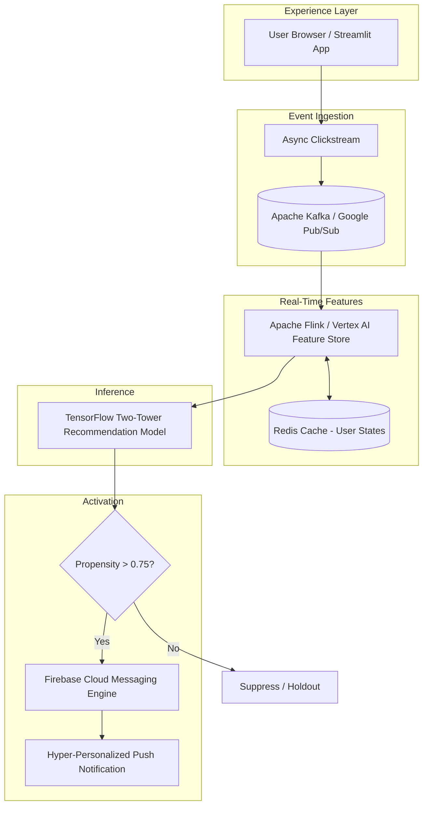
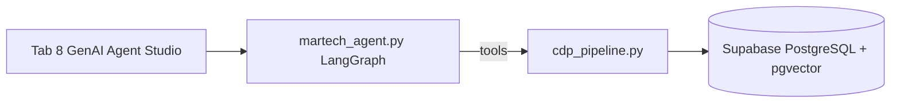

# Personalization & Ad Targeting Simulator

This Streamlit portfolio app demonstrates a recommendation engine and marketing
technology platform for a digital marketplace. It simulates how behavioral signals,
browser intent, app signals, customer lifecycle, and merchandising goals can
work together to recommend products and decide when marketing emails should be
suppressed or reactivated.

Core UI logic lives in `streamlit_app.py`. MarTech signal processing, hybrid ranking,
and propensity-gated notifications are encapsulated in `martech_engine.py`.

**Agentic RAG (new):** A production-style CDP on **Supabase + pgvector** (`cdp_pipeline.py`),
an autonomous campaign agent (`martech_agent.py`), and **Tab 8: GenAI Agent Studio**
(`genai_agent_studio.py`) demonstrate natural-language orchestration over golden records,
guardrails, vector retrieval, and notification queueing.

## Demo scope

- 500 generated products across sport categories, audiences, and product
  types.
- 100 generated members split across repeat and new customers, men and
  women, demographics, browser signals, and app usage.
- Explore-vs-exploit ranking for repeat and new customers.
- Lifecycle orchestration for new visitors, first-purchase prospects, repeat
  runners, lapsed runners, active members, and high-value members.
- Privacy modes for full consent, limited consent, and no app usage data.
- Explainable recommendation labels for interview storytelling.
- Sale and trending product ribbons.
- Dropdown filtering for men, women, kids, footwear, apparel, and accessories.
- Shoe email suppression when a member recently purchased footwear.
- Running shoe email reactivation after the 5.5 month replenishment window.
- App usage signals, frequency caps, channel preferences, and
  consent-aware Martech email decisions.
- Simulated A/B experiment metrics and executive business impact estimates.
- Dedicated A/B Testing Lab with hypothesis, population, randomization unit,
  traffic allocation, sample assumptions, primary metric, guardrails, variants,
  result readout, and launch checklist.
- Sponsored product auction and portfolio metrics.
- Trust & Safety, privacy guardrails, reference architecture, and product pain
  points to discuss in interviews and roadmap conversations.
- Architecture Diagram tab to visualize end-to-end product workflow.
- **MarTech engine** (`martech_engine.py`): mock Bronze → Silver → Gold medallion layers for 0-party and session behavioral signals.
- **Hybrid recommendations**: sidebar A/B variant (behavioral-only vs. 0-party + behavioral blend) with instant re-ranking on View/Click.
- **Live product grid** with per-card “Why am I seeing this?” captions driven by current member state.
- **Propensity-scored push notifications**: queue only when score > 0.75; inspect decisions in **MarTech Backend: Propensity Logs** (sidebar).
- **Supabase CDP**: stitched schema (`consumers`, `products`, `behavioral_logs`) with **HNSW** vector index and `match_products` RPC.
- **CDP pipeline** (`cdp_pipeline.py`): golden-record stitch, semantic search, agent context compilation.
- **Autonomous MarTech agent** (`martech_agent.py`): LangGraph ReAct + OpenAI tool-calling over CDP tools.
- **GenAI Agent Studio (Tab 8)**: chat UI, reasoning telemetry trace, simulated push notification card.

## Project structure

| File / path | Purpose |
|-------------|---------|
| `streamlit_app.py` | PersonaScale AI UI, 8 tabs, session state, command-bar variant controls |
| `personascale_ui.py` | Enterprise CSS, KPI shelf, product cards, engine telemetry |
| `martech_engine.py` | Medallion layers, hybrid ranking, interaction tracking, propensity scoring |
| `genai_agent_studio.py` | Tab 8 — chat, telemetry trace, CDP/simulator orchestration UI |
| `cdp_pipeline.py` | Supabase CDP: stitch golden record, embed + `match_products`, agent context |
| `martech_agent.py` | LangGraph agent: profile, guardrails, inventory search, queue notification |
| `seed_data.py` | In-memory product registry and simulated 1st-party event logs |
| `ranking.py` | Base 0-party ranking, lifecycle email rules, A/B simulation helpers |
| `data_generator.py` | Marketplace bootstrap via `initialize_marketplace()` |
| `auction.py` | Sponsored product auction scoring |
| `metrics.py` | CTR, conversion, ROAS, and diversity metrics |
| `supabase/migrations/...sql` | CDP DDL: pgvector, tables, HNSW index, `match_products` RPC |
| `supabase/seed_demo.sql` | Demo row: `USER_7721`, HydroStream vest, behavioral view events |
| `scripts/pre-demo.ps1` | Pre-demo health checks + checklist |
| `scripts/setup-cdp-venv.ps1` | Creates `.venv-cdp` (Python 3.12) for CDP/agent deps |
| `scripts/backfill_product_embeddings.py` | Writes 384-d embeddings to Supabase `products` |
| `requirements.txt` | Streamlit app only (Python 3.10–3.14) |
| `requirements-cdp.txt` | Supabase + sentence-transformers |
| `requirements-agent.txt` | LangChain + LangGraph + OpenAI |
| `.env` | `SUPABASE_URL`, `SUPABASE_KEY`, optional `OPENAI_API_KEY` (gitignored) |

## Production architecture blueprint (scalable infra)

This prototype (`PersonaScale AI`) simulates the product surface in Streamlit. The blueprint below is the **target production architecture** for scaling real-time personalization, feature serving, and propensity-gated push orchestration.

### End-to-end flow

```
[User Browser / Streamlit App]
       │
       ▼ (Async Clickstream)
[Apache Kafka / Google Pub/Sub]
       │
       ▼ (Stream Processing Engine)
[Apache Flink / Vertex AI Feature Store] <───> [Redis Cache (User States)]
       │
       ▼ (Inference Engine Model)
[TensorFlow Two-Tower Recommendation Model]
       │
       ▼ (If Propensity Threshold > 0.75)
[Firebase Cloud Messaging Engine] ───> (Hyper-Personalized Real-Time Push Notification)
```



### Layer responsibilities

| Layer | Production service | Role in PersonaScale |
|-------|-------------------|----------------------|
| Experience | Streamlit → Web/Mobile app | Member strategy UI, recommendation shelf, telemetry (demo: `streamlit_app.py`, `personascale_ui.py`) |
| Clickstream | Kafka / Pub/Sub | Durable async events: views, clicks, PDP dwell, cart signals |
| Stream processing | Flink / Dataflow + Feature Store | Bronze → Silver → Gold feature materialization, session aggregation |
| Online state | Redis | Sub-10ms user profile, frequency caps, last-N interactions, propensity inputs |
| Ranking | Two-tower TF model | Hybrid retrieval: 0-party tower + behavioral tower (demo: `rank_products_variant`) |
| Propensity gate | Rules + ML calibrator | Score 0.0–1.0; activate push only above **0.75** (demo: `martech_engine.compute_propensity_score`) |
| Activation | Firebase Cloud Messaging | Real-time push with consent, channel, and lifecycle guardrails |

### Demo → production mapping

| Prototype module | Production equivalent |
|------------------|----------------------|
| `seed_data.get_mock_1st_party_data()` | Feature Store + CRM/CDP purchase and engagement history |
| `martech_engine` medallion layers | Flink jobs writing to BigQuery / Feature Store entities |
| `st.session_state["interactions"]` | Kafka topic `clickstream.v1` consumed into Redis user state |
| `rank_products_variant` (A/B) | Two-tower serving with experiment flags (LaunchDarkly / Vertex Experiments) |
| Propensity logs expander | Observability: Datadog + BigQuery audit table for decision traces |
| Notification queue (session) | FCM topic sends with idempotency keys and rate limiting |

### Scalability and reliability patterns

- **Ingest:** partition Kafka/Pub/Sub by `member_id`; at-least-once delivery with dedupe keys on `(member_id, event_id)`.
- **Features:** Flink windowed aggregations (1m / 1h / 7d) into Vertex AI Feature Store; Redis as online serving cache with TTL aligned to session length.
- **Inference:** two-tower batch embeddings offline; online ANN retrieval (e.g., Vertex Matching Engine) + lightweight rerank for business rules (margin, inventory, consent).
- **Propensity:** separate calibrator model or logistic layer on top of rank score; hard guardrails for consent, frequency cap, and channel preference before FCM.
- **Push:** async worker pool reading “eligible notification” topic; FCM with collapse keys, quiet hours, and holdout buckets for incrementality measurement.
- **SLOs (targets):** clickstream ingest p99 < 2s; feature freshness < 60s; rank + propensity p99 < 150ms; push dispatch < 5s from trigger event.

### Security and privacy

- Consent flags gate all behavioral features before Feature Store write.
- PII tokenization at ingest; Redis keys use hashed `member_id`.
- FCM payloads contain no raw health or precise location data; use category-level affinity only.

## Current app tabs

| Tab | Name | Primary demo value |
|-----|------|-------------------|
| 1 | Member & Strategy | Configure member, privacy, sliders; **Run Simulation** (required for Tab 8 fallback) |
| 2 | Recommendations | Live grid, hybrid ranking, explainability |
| 3 | Marketing & Ads | Email rules, propensity-gated push |
| 4 | Portfolio Metrics | Executive metrics (may hit known auction bug) |
| 5 | A/B Testing Lab | Experiment design readout |
| 6 | Trust & Safety | Privacy principles and architecture story |
| 7 | Architecture Diagram | End-to-end workflow image |
| 8 | **GenAI Agent Studio** | **Agentic RAG** — NL chat, tool telemetry, push alert |

## Sidebar controls

- **Recommendation Variant** — Variant A (behavioral-only) or Variant B (hybrid: 70% base ranker + 30% session behavioral).
- **MarTech Backend: Propensity Logs** — expandable log of push propensity evaluations (score, threshold, queued vs. suppressed).

---

## Agentic RAG, CDP, and autonomous agent

### Architecture (demo stack)



| Layer | Component | Role |
|-------|-----------|------|
| Experience | `genai_agent_studio.py` | `st.chat_input`, chat history, telemetry expander, `st.success` push card |
| Agent | `martech_agent.py` | ReAct loop; tools: `get_customer_profile`, `evaluate_guardrails`, `search_inventory`, `queue_notification` |
| CDP | `cdp_pipeline.py` | Golden record stitch; MiniLM embeddings; `match_products` RPC |
| Data | Supabase | `consumers`, `products`, `behavioral_logs`; HNSW on `description_embedding` |

### Demo persona: `USER_7721`

After `seed_demo.sql`:

- **Segment:** High-Value Runner · **Interests:** Marathon Training, Trail Running
- **Guardrail:** shoe purchase **14 days ago** → `shoe_promotions_suppressed = true`
- **Behavior:** 3× views on `AeroGlow Shoes` (logged in `behavioral_logs`)
- **Catalog:** `ACC-004` HydroStream 2L Hydration Vest (vector match target)

### Agent tools (what the LLM calls)

1. **`get_customer_profile(user_id)`** — Bronze/Silver/Gold stitch: profile + last 10 behavioral events.
2. **`evaluate_guardrails(user_id)`** — Suppression window, frequency cap, consent, `outreach_allowed`.
3. **`search_inventory(query, user_id)`** — Cosine ANN via `match_products`; auto-excludes **Footwear** when suppressed.
4. **`queue_notification(user_id, message)`** — Inserts `push_sent` into `behavioral_logs` + local JSON queue under `artifacts/notification_queue/`.

### Strict agent policy (system prompt)

- Always: profile → guardrails → search → (optional) queue.
- **Must not** promote footwear when shoe suppression is active—even if the user prompt mentions shoe browsing.
- Pivot to accessories/apparel/hydration via vector search.
- Queue outreach only when `outreach_allowed` is true.

---

## Before demo — complete checklist

### A. One-time Supabase setup

1. Open your project → **SQL Editor**.
2. Run **`supabase/migrations/20260518120000_cdp_stitched_schema.sql`** (creates extension, tables, HNSW index, RPCs).
3. Run **`supabase/seed_demo.sql`** (inserts `USER_7721`, product `ACC-004`, sample behavior).
4. Backfill embeddings (required for non-empty vector search):

   ```powershell
   .\.venv-cdp\Scripts\python.exe scripts\backfill_product_embeddings.py
   ```

   **Expected:** console prints `Embedded: ACC-004` (and any other SKUs without vectors).

### B. Local environment

| Step | Command / action | Expected result |
|------|------------------|-----------------|
| Copy secrets | `.env.example` → `.env` | File gitignored |
| Supabase URL | `SUPABASE_URL=https://<ref>.supabase.co` | Matches dashboard |
| Supabase key | `SUPABASE_KEY` = anon JWT `eyJ...` preferred | `get_supabase_client()` succeeds; no 401 on queries |
| OpenAI (optional) | `OPENAI_API_KEY=sk-...` | Only needed for Tab 8 **“Use full LLM agent”** toggle |
| CDP venv | `.\scripts\setup-cdp-venv.ps1` | `.venv-cdp` with Python 3.12 |
| Health check | `.\scripts\pre-demo.ps1` | Green OK lines; warnings documented |

### C. Ten minutes before presenting

| Step | Action | Expected result |
|------|--------|-----------------|
| 1 | `.\scripts\pre-demo.ps1` | Supabase connected; `USER_7721` golden record OK (or clear migration reminder) |
| 2 | Start Streamlit | Terminal: `You can now view your Streamlit app` → **http://localhost:8501** |
| 3 | Tab 1 → **Run Simulation** | Green toast: simulation saved |
| 4 | Tab 8 → `USER_7721` → send sample prompt | See [Tab 8 expected results](#tab-8-genai-agent-studio--expected-results) |

### Sample Tab 8 prompt

```text
USER_7721 viewed AeroGlow Shoes 3 times in 10 minutes. Shoe purchase was 14 days ago.
Check guardrails and build a hydration accessory campaign — no footwear promos.
```

**Settings:** leave **“Use full LLM agent (OpenAI)”** **OFF** unless billing/quota is active.

---

## How to run locally

### Two Python environments (important)

| Environment | Python | Requirements | Used for |
|-------------|--------|--------------|----------|
| **System / default** | 3.10–3.14 | `requirements.txt` | **Streamlit UI** (`streamlit run ...`) |
| **`.venv-cdp`** | 3.11 or **3.12** | `requirements-cdp.txt` + `requirements-agent.txt` | CDP, embeddings, `martech_agent` CLI |

Streamlit on 3.14 cannot load `sentence-transformers` / full CDP stack; Tab 8 **falls back** to Tab 1 simulator data when CDP is unavailable.

### Start the Streamlit app

```powershell
cd c:\Users\agarw\adtech-platform\blank-app
pip install -r requirements.txt
python -m streamlit run streamlit_app.py --server.enableCORS false --server.enableXsrfProtection false
```

Or:

```powershell
.\scripts\run-streamlit.ps1
# or
.\scripts\pre-demo.ps1 -StartStreamlit
```

Open **http://localhost:8501**. Do **not** use `npm run dev` (separate Node app on port 3001).

### CDP / agent CLI (optional)

```powershell
.\.venv-cdp\Scripts\Activate.ps1
python -c "from cdp_pipeline import stitch_golden_record; print(stitch_golden_record('USER_7721'))"
python martech_agent.py --demo USER_7721 "Viewed AeroGlow Shoes 3x; shoe purchase 14 days ago."
```

Artifacts: campaign reports in `artifacts/campaign_runs/`; queued pushes in `artifacts/notification_queue/`.

---

## Demo script (5–7 minutes) and expected results

### Tab 1 — Member & Strategy

**Steps:** Choose segment / customer type / gender → set privacy mode and sliders → expand signals JSON → **Run Simulation**.

**Expect:**

- Metrics row: ~500 products, ~100 members.
- Success message: *“Simulation saved. Open Recommendations, Marketing & Ads…”*
- `st.session_state["user"]` populated for downstream tabs.

### Tab 2 — Recommendations

**Steps:** Toggle **Recommendation Variant** (below KPIs) → **View** / **Click** products on the grid.

**Expect:**

- Rank order changes after each interaction (hybrid variant blends session behavior).
- Product cards show **“Why am I seeing this?”** captions.
- Optional: **Semantic profile (Bronze → Silver → Gold)** expander with merged signals.

### Tab 3 — Marketing & Ads

**Steps:** Open after Tab 1 + some Tab 2 clicks.

**Expect:**

- Shoe email status string (suppress vs eligible) from `shoe_email_status()`.
- Propensity-gated push section; score > **0.75** may queue a notification.
- Sidebar **MarTech Backend: Propensity Logs** table fills with evaluations.

**Note:** Tabs 3–4 auction path may error (`auction.py` `seller_id` bug)—use Tabs 1, 2, 8 for a clean live path.

### Tab 8 — GenAI Agent Studio — expected results

**Steps:**

1. Set **CDP external_id** to `USER_7721`.
2. Paste the [sample prompt](#sample-tab-8-prompt) in **Ask the MarTech agent…**.
3. Expand **Agent Reasoning Telemetry Trace**.

**Expect (CDP mode — Supabase configured):**

| Telemetry step | What you should see |
|----------------|---------------------|
| CDP golden record stitch | Segment **High-Value Runner**; interests Marathon / Trail |
| Guardrail evaluation | **Shoe promotions SUPPRESSED** warning |
| Semantic vector retrieval | Query focused on hydration/accessories; **Footwear excluded**; ≥1 SKU (e.g. `ACC-004`) |
| `queue_notification` | **Complete** if `outreach_allowed` and inventory exists |

**Chat assistant reply should include:**

- Guardrail status (shoe suppression active).
- Top SKU recommendation (hydration vest, not shoes).
- Outreach **queued** or **SUPPRESSED** with explicit reason.

**UI:**

- User and assistant messages in chat history (`st.session_state.agent_messages`).
- Green **`st.success`** card with **simulated push notification** copy (channel Push, message text).

**Expect (simulator fallback — no Supabase / CDP on Python 3.14):**

- Yellow banner: CDP agent runtime not loaded.
- After Tab 1 simulation: telemetry uses in-memory catalog; shoe suppress message from `shoe_email_status()`; non-footwear products from local DataFrame.

### Tab 8 — what *not* to expect without setup

| Missing setup | Symptom |
|---------------|---------|
| Migration not run | Error: `consumers` table not found |
| Seed not run | `USER_7721` not found |
| Embeddings not backfilled | Empty vector search `[]` |
| OpenAI quota exhausted | Use instrumented mode (toggle OFF), not full LLM |
| Tab 1 not run (fallback only) | “Run Simulation first” message |

---

## Quick start (classic 7-tab flow)

1. Open **Member & Strategy**, pick a member, set privacy and sliders, then click **Run Simulation**.
2. Open **Recommendations** — use **View** / **Click** on the live product grid; ranking updates on each interaction.
3. Toggle **Recommendation Variant** (horizontal radios below KPI metrics).
4. Open **Marketing & Ads** — propensity-gated push (interact in Recommendations first to raise propensity above 0.75).
5. Open **GenAI Agent Studio** — run the [Tab 8 prompt](#sample-tab-8-prompt).
6. Explore other tabs as time allows.

## Interview framing (FAANG-style)

### Architecture principles

- User trust first: consent and communication controls gate personalization.
- Business + user balance: ranking and auction optimize outcomes while protecting relevance.
- Explainability by default: recommendations include plain-language rationale.
- Experiment-driven iteration: A/B testing drives rollout decisions with guardrails.

### Key trade-offs

- Relevance vs. exploration (precision vs. discovery)
- Revenue vs. fairness (monetization vs. marketplace diversity)
- Personalization depth vs. privacy (signal richness vs. data minimization)
- Velocity vs. risk (shipping speed vs. guardrail quality)

## Member selection criteria

- Member segment
- Customer type
- Member gender
- Privacy preference (how much the user wants to share)

## MarTech engine (medallion + propensity)

### Signal layers (mock semantic pipeline)

1. **Bronze** — raw 0-party inputs: interests, browser signal, segment, consent flags, app signals.
2. **Silver** — session behavioral aggregates: product views/clicks and category engagement.
3. **Gold** — unified member profile passed into ranking and Martech decisions (visible under **Semantic profile** on the Recommendations tab).

### Recommendation variants

| Variant | Behavior |
|---------|----------|
| **Variant A: Behavioral-Only** | Ranks primarily from session views/clicks plus popularity, trend, and recency. |
| **Variant B: Hybrid Model** | Blends the existing 0-party `rank_products()` score with `behavioral_score` (70% / 30%). |

Session interactions update `behavioral_score` per product and category in real time via Streamlit reruns.

### Push propensity (Marketing & Ads)

`propensity_score` (0.0–1.0) combines consent, session engagement, top-product relevance, and lifecycle stage. Push notifications are **queued only when score > 0.75** and lifecycle/channel gates allow. Email rules in `ranking.py` still apply separately.

## Scoring logic

### Recommendations tab scoring

- `interest_score`: `1.0` when product category matches member interests, else `0.0`.
- `browser_score`: `1.0` when browser intent matches category, or when intent is `Sale` and product is on sale, or `Trending` with trend >= 70; else `0.0`.
- `trend_score`: base trend signal from product catalog; used as normalized `trend_norm = trend_score / max(trend_score)`.
- `final_score`: weighted combination of personalization, business, lifecycle, and exploration components:

  `final_score =`
  `interest_score * 0.30 * exploit_weight`
  `+ audience_score * 0.18 * exploit_weight`
  `+ browser_score * 0.15 * exploit_weight`
  `+ app_score * 0.14 * exploit_weight`
  `+ popularity_norm * 0.12 * exploit_weight`
  `+ trend_norm * 0.06 * exploit_weight`
  `+ recency_norm * 0.05 * exploit_weight`
  `+ margin_score * lifecycle_boost`
  `+ trend_norm * discovery_boost`
  `+ lifecycle_score`
  `+ random_exploration(0..explore_weight)`

  Where:
  - `explore_weight = explore_exploit / 100`
  - `exploit_weight = 1 - explore_weight`
  - `lifecycle_boost = 0.12` for repeat members, else `0.0`
  - `discovery_boost = 0.12` for new members, else `0.0`

**Hybrid variant (Variant B)** additionally applies:

`final_score = base_final_score * 0.70 + behavioral_score * 0.30`

where `behavioral_score` is derived from per-product and per-category session views and clicks.

### Marketing & Ads tab scoring

- `relevance`: `1.0` when ad product category matches member interests, else `0.2`.
- `fairness_factor`: `1.25` for small sellers when diversity guardrail is enabled, else `1.0`.
- `final_score`:

  `roas_weight = roas_fairness / 100`  
  `fairness_weight = 1 - roas_weight`  
  `final_score = (bid_amount * roas_weight) + (relevance * 0.5) + (fairness_factor * fairness_weight)`

## Signals captured for scoring

- Member interests and lifecycle stage
- Browser intent signal
- App affinity signals
- Audience fit (Men/Women/Kids)
- Product trend, popularity, recency, and margin
- Seller type (`is_small_seller`)
- Bid amount
- Privacy preference and consent mode
- ROAS vs fairness and explore vs exploit controls

## Suggested additional signals

- Inventory and size availability by location
- Price affinity and discount sensitivity
- Return risk and fit confidence
- Session context (device, channel, time of day)
- Weather and seasonality
- Fulfillment promise (delivery speed)
- Campaign pacing, budget constraints, and ad quality
- Predicted CTR/CVR and post-click quality outcomes

## Example calculations

### Recommendations example

Assume:
- `explore_exploit = 30` => `explore_weight = 0.30`, `exploit_weight = 0.70`
- Repeat member => `lifecycle_boost = 0.12`, `discovery_boost = 0.0`
- `interest_score = 1.0`
- `audience_score = 1.0`
- `browser_score = 1.0`
- `app_score = 0.5`
- `popularity_norm = 0.8`
- `trend_norm = 0.7`
- `recency_norm = 0.9`
- `margin_score = 0.6`
- `lifecycle_score = 0.08`
- `random_exploration = 0.12`

Calculation:

`final_score =`
`(1.0*0.30*0.70) + (1.0*0.18*0.70) + (1.0*0.15*0.70) + (0.5*0.14*0.70) +`
`(0.8*0.12*0.70) + (0.7*0.06*0.70) + (0.9*0.05*0.70) + (0.6*0.12) +`
`(0.7*0.0) + 0.08 + 0.12`

`final_score = 0.8885` (approx.)

What changes this score most:
- Strongest positive levers are `interest_score`, `audience_score`, and `browser_score` because of their higher weights.
- For repeat members, `margin_score * lifecycle_boost` can materially move rank order.
- Increasing `explore_exploit` raises exploration noise and can reshuffle close-ranked products.

### Marketing & Ads example

Assume:
- `roas_fairness = 60` => `roas_weight = 0.60`, `fairness_weight = 0.40`
- `bid_amount = 1.80`
- `relevance = 1.0` (interest-category match)
- `fairness_factor = 1.25` (small seller + diversity on)

Calculation:

`final_score = (1.80*0.60) + (1.0*0.5) + (1.25*0.40)`

`final_score = 1.08 + 0.5 + 0.5 = 2.08`

What changes this score most:
- Higher `bid_amount` dominates when `roas_fairness` is set high.
- `relevance` strongly affects rank quality and keeps ads aligned with member intent.
- `fairness_factor` has larger impact when `roas_fairness` is lower (more fairness weight).

## View the live prototype

Anyone can open and view the deployed prototype using this public URL:

- https://blank-app-zwp52hqbzm2sxhgqckmv6w.streamlit.app/

No local setup is required for viewing. Open the link in any browser.

After pushing changes to GitHub, Streamlit Community Cloud redeploys from `main` (usually within a few minutes). If the live app looks stale:

1. Confirm the latest commit is on `origin/main` (includes `martech_engine.py`).
2. Open [share.streamlit.io](https://share.streamlit.io) → your app → verify **Repository** `bharat2476/blank-app`, **Branch** `main`, **Main file** `streamlit_app.py`.
3. Check deploy logs for errors, then **Reboot app** and hard-refresh the URL (Ctrl+F5).

**Signs the new build is live:** **PersonaScale AI** header and KPI shelf; **Recommendation Variant** horizontal radios below KPIs; Recommendations tab includes **Retail Recommendation Shelf**; Marketing & Ads includes **Push Notification (Propensity-Gated)**; eighth tab **GenAI Agent Studio** with chat + telemetry trace.

**Tab 8 on Streamlit Cloud** requires secrets (`SUPABASE_URL`, `SUPABASE_KEY`, optional `OPENAI_API_KEY`) in the app settings—**local demo is recommended** for the full Agentic RAG path.

## Troubleshooting

| Symptom | Fix |
|---------|-----|
| `pip install -r requirements.txt` fails on Python 3.14 with `pyiceberg` / MSVC | Use `requirements.txt` only for Streamlit; install CDP stack in `.venv-cdp` via `setup-cdp-venv.ps1` |
| `consumers` table not found | Run migration SQL in Supabase SQL Editor |
| `USER_7721` not found | Run `supabase/seed_demo.sql` |
| Vector search returns `[]` | Run `scripts/backfill_product_embeddings.py` |
| Supabase 401 Invalid API key | Use anon JWT (`eyJ...`) from Project Settings → API |
| `OPENAI_API_KEY is not set` | Add to `.env` or leave Tab 8 LLM toggle OFF |
| OpenAI 429 / insufficient_quota | Tab 8: disable LLM toggle; use `python martech_agent.py --demo ...` |
| Tab 8 CDP warning on Streamlit 3.14 | Expected; run Tab 1 simulation for fallback, or use CDP venv for CLI tests |
| Tabs 3–4 auction errors | Known `auction.py` issue — demo Tabs 1, 2, 8 |
| `.env` not loading OpenAI key | Remove invalid `//` comment lines; use `#` only |

See also **`PRE_DEMO.md`** for a printable runbook.

## Verify imports (optional)

```powershell
python -c "import streamlit_app"
.\.venv-cdp\Scripts\python.exe -c "from martech_agent import MARTECH_TOOLS; print(len(MARTECH_TOOLS))"
```
